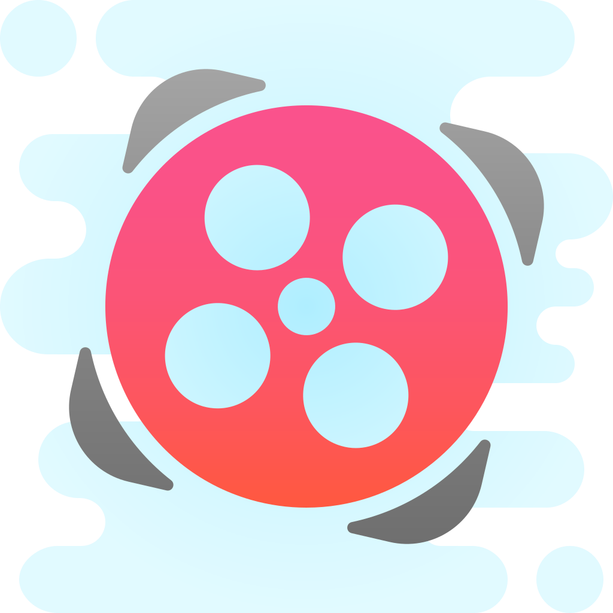
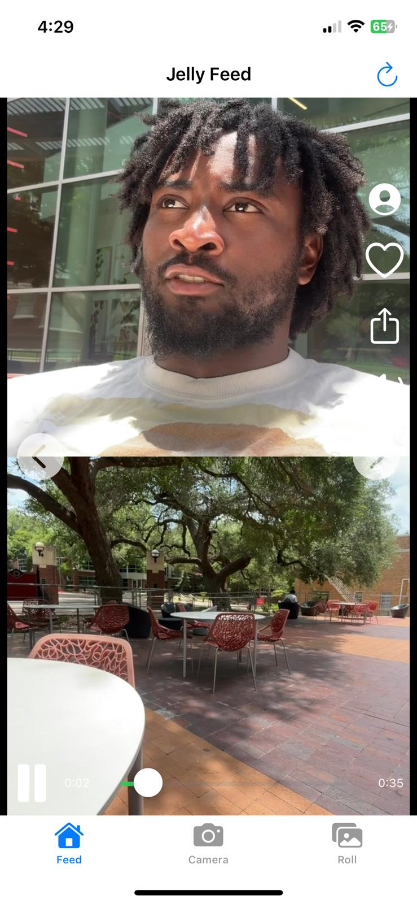
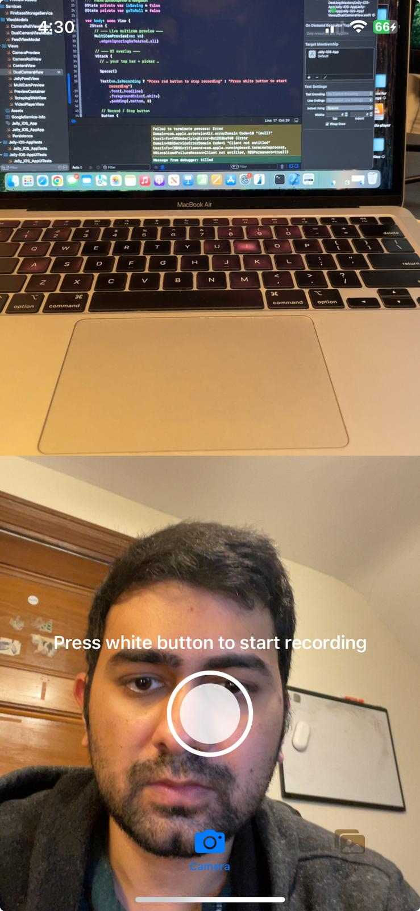
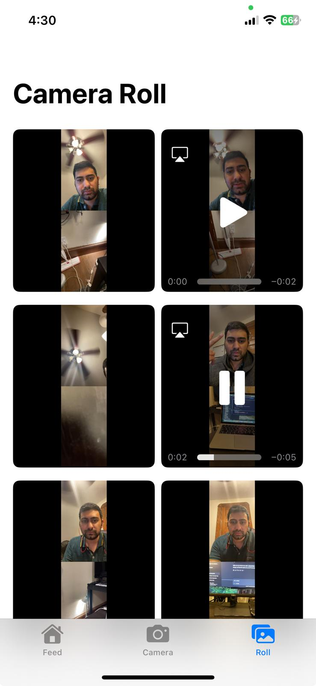

# Jelly-iOS-App
A 3-tab Swift iOS app featuring a TikTok-style video feed, a dual-camera interface that records synced front/back videos, and a local camera roll for playback. Built to showcase AVFoundation, media handling, and intuitive UI/UX design.


<!-- App Icon -->
<p align="center">
  
</p>


---

## 🧭 Overview

This app has **three tabs**:

1. **Feed:** A vertical TikTok-style UI showcasing videos scraped from Jelly’s public website.  
2. **Camera:** Record dual-camera (front & back) synchronized videos in a split-screen view.  
3. **Camera Roll:** Displays recorded videos in a scrollable grid view, with inline and full-screen playback.

---

## 🧠 Tech Highlights

- **AVFoundation** – Dual-camera capture with `AVCaptureMultiCamSession`  
- **SwiftUI + UIKit** – Combined for UI rendering and camera control  
- **WKWebView** – JavaScript-powered web scraping  
- **Firebase Storage** – Seamless video upload & retrieval  
- **MVVM Architecture** – Clean separation of logic & presentation  

---

## 🗂 File Structure

```plaintext
Jelly-iOS-App/
├── Jelly-iOS-App/           ← Xcode project folder
│   ├── Models/
│   │   └── Video.swift
│   ├── Services/
│   │   ├── FirebaseStorageService.swift
│   │   └── VideoService.swift
│   ├── ViewModels/
│   │   ├── FeedViewModel.swift
│   │   ├── DualCameraViewModel.swift
│   │   └── CameraRollViewModel.swift
│   ├── Views/
│   │   ├── ContentView.swift
│   │   ├── JellyFeedView.swift
│   │   ├── ScrapingWebView.swift
│   │   ├── PreviewContainer.swift
│   │   ├── VideoPlayerView.swift
│   │   ├── VideoRowView.swift
│   │   ├── MultiCamPreview.swift
│   │   ├── DualCameraView.swift
│   │   ├── CameraPreview.swift
│   │   └── CameraRollView.swift
│   ├── Assets.xcassets/
│   └── GoogleService-Info.plist
└── Screenshots/
    ├── feed_screen.png
    ├── camera_screen.png
    └── roll_screen.png

```
---

## 🧱 MVVM Architecture

- **Models:** Data structures (`Video.swift`)  
- **ViewModels:** Business logic & state (`FeedViewModel`, `DualCameraViewModel`, `CameraRollViewModel`)  
- **Views:** SwiftUI + `UIViewRepresentable` UIs; minimal logic  
- **Services:** APIs & integrations (`FirebaseStorageService.swift`, `VideoService.swift`)

---

## 📸 Tab 1 – Feed

> Jelly’s video feed UI mimics TikTok with swipeable vertical cards.

🧩 **UI Elements:**

- Navigation bar with **“Jelly Feed”** title  
- `WKWebView` scraper extracts video URLs from `<link rel="prefetch">` tags  
- Full-screen `VideoPlayer` per card with:
  - Mute/unmute & play/pause  
  - Like, share, profile icons  
  - Custom progress bar with seek support  
  - Swipe left/right for manual navigation  
- Autoplay & auto-advance when playback ends  

🖼 **Screenshot:**



---

## 🎬 Tab 2 – Dual Camera

> Simultaneously captures and records from front & back cameras.

🧩 **UI Elements:**

- **MultiCamPreview**:  
  - Top: back camera preview  
  - Bottom: front camera preview  
- **Recording Controls**:  
  - Prompt: “Press white button to start recording” → turns red while recording  
  - Circular record button (white idle, red active)  
- **Post-record Spinner**:  
  - Full-screen spinner with “Saving…” message  
  - 5 s delay for Firebase sync  
  - Auto-switch to Camera Roll tab when done  

🖼 **Screenshot:**



---

## 📁 Tab 3 – Camera Roll

> Displays all recorded videos in a scrollable grid fetched from Firebase.

🧩 **UI Elements:**

- Title: **Camera Roll**  
- `LazyVGrid` for 2-column layout  
- Each cell:  
  - Thumbnail + inline playback with scrubber  
  - Tap to expand full-screen  
- Automatically lists all `.mov` files in Firebase Storage  

🖼 **Screenshot:**



---

## 💭 Thought Process & Trade-offs

### Feed Scraping
- **Decision:** JavaScript extraction from `<link rel="prefetch">` tags  
- **Why:** No public API; avoids brittle HTML parsing  

### Dual-Cam AVFoundation
- **Approach:** `AVCaptureMultiCamSession` + `AVAssetWriter` to merge tracks  
- **Limitation:** iPhone XS+ required  

### Firebase Integration
- **Reason:** Quick setup for storage without custom backend  
- **Trade-off:** Exposed API key—mitigated via domain restriction  

### UI/UX
- Clear state indicators (prompts, button colors)  
- Custom progress & spinner overlays for async feedback  

---

## 🚀 Getting Started

1. **Clone the repo**  
   ```bash
   git clone https://github.com/akshit1098/Jelly-iOS-App.git
   cd Jelly-iOS-App/Jelly-iOS-App

2. Setup Firebase

Download GoogleService-Info.plist from your Firebase console

Drag into Jelly-iOS-App in Xcode (do not commit it publicly)

3. Build & Run

Use a real iPhone (multi-cam unsupported in Simulator)

Grant Camera & Microphone permissions

## 🌱 Future Improvements
Firebase Authentication & user profiles

Like/comment interactions on feed videos

AR filters & camera effects

Offline caching & background retry logic

Expanded test coverage (unit + UI)


## 🎥 Demo

- **Tab 1 – Feed** demo:  
  🔗 [Watch on Google Drive](https://drive.google.com/file/d/1dFzL-FL0pLCP3GnycLXI_grLdBpXFLQ7/view?usp=sharing)  
- **Tab 2 & 3 – Camera Recording & Roll** demo:  
  🔗 [Watch on Google Drive](https://drive.google.com/file/d/1QixMFoXeDeQHK32UV6DhjJTqUBTvOs88/view?usp=sharing)


## 🧪 Final Notes
Demonstrates a full-stack iOS prototype with:

Low-level AVFoundation camera access

SwiftUI & UIKit integration

Combine-powered async handling

End-to-end media lifecycle: Capture → Encode → Upload → Display

